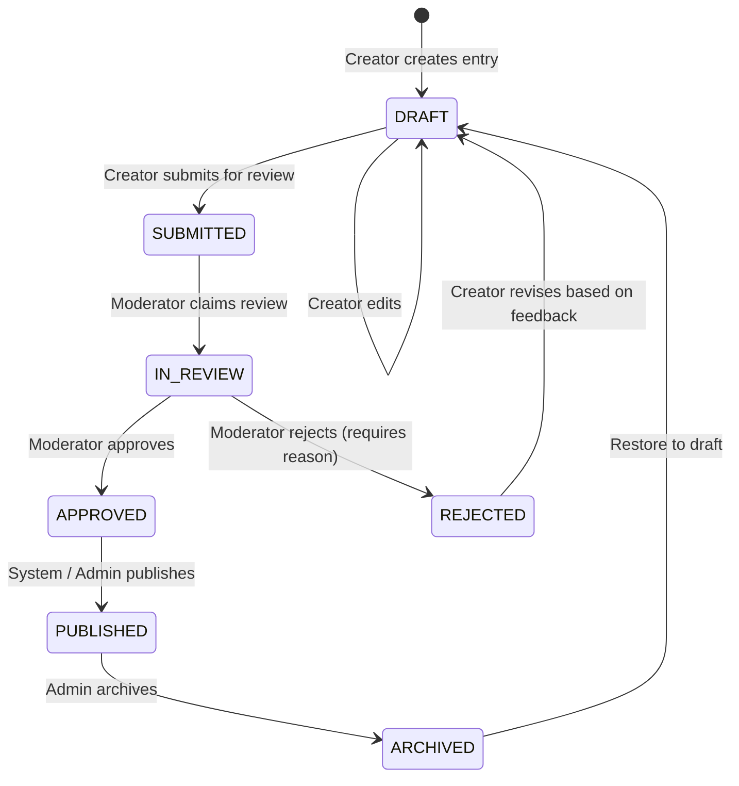

# CG Tourism Template & Render Engine — Architecture Specification

This document provides the canonical technical architecture for the **Generic Tourism Content Template Engine** across `Chhattisgarh--Tourism`.

---

## 1. Architectural Principles

1. **Tourism Content as Data, Not Code**: No new database table or code deployment is required to introduce a new tourism content type (e.g., Destination, Place, Festival, Folklore, Cuisine, Tribal Story, Itinerary, Event, Attraction, Route).
2. **Single Canonical Engine**: Exactly one canonical implementation exists for each system responsibility:
   - Schema & Validation: `@cg-tourism/template-engine`
   - Backend API & Lifecycle: `apps/backend/src/modules/content-template/`
   - Frontend Builder & Forms: `apps/web/src/components/templates/` and `apps/web/src/components/content/`
3. **Immutable Versioning**: Published templates create immutable version snapshots (`TemplateVersion`). Existing entries pin to their template version, preventing retroactive schema breakage.
4. **Spatial First**: Standardized spatial coordinates (`latitude`, `longitude`, PostGIS `geography(Point, 4326)`) empower unified geo-discovery across all tourism categories.
5. **Strict RBAC & Auditability**: Transition state machine enforced on both frontend and backend, with full audit trail logging for all status changes.

---

## 2. High-Level System Architecture

```mermaid
graph TD
  subgraph "Admin CMS Layer"
    TB["TemplateBuilder (/admin/templates)"]
    TVM["Version Manager (/admin/templates/:id/versions)"]
    TDS_UI["Drift Monitor (/admin/templates/:id/drift)"]
  end

  subgraph "Creator Portal"
    DEF["DynamicEntryForm (/creator/entries/new)"]
    DED["Draft Manager (/creator/entries)"]
  end

  subgraph "Moderation Console"
    MOD_QUEUE["Review Queue (/moderator/reviews)"]
    DIFF_VIEW["Version Diff & Inspection"]
  end

  subgraph "Public Tourism Portal"
    DEP["DynamicEntryPage (/content/:slug)"]
    SEARCH["Geo & Fulltext Discovery Engine"]
  end

  subgraph "Core Package: @cg-tourism/template-engine"
    SCHEMA["schema (Zod definitions)"]
    VAL["validation (Field validators)"]
    REND["render (Layout & widgets)"]
    VERS["versioning (Semver & diff)"]
    I18N["i18n (Multilingual en/hi)"]
    MEDIA["media (CDN & responsive assets)"]
    VOICE["voice (Audio guides & TTS)"]
    A11Y["accessibility (WCAG 2.1 AA)"]
    EXT["extensibility (Plugin hooks)"]
  end

  subgraph "Backend Engine: modules/content-template"
    CTS["ContentTemplateService"]
    CES["ContentEntryService"]
    TAS["TemplateAccessService"]
    TDS["TemplateDriftScheduler"]
  end

  subgraph "PostgreSQL / PostGIS Database"
    CT["ContentTemplate & TemplateField"]
    TV["TemplateVersion (Immutable Snapshots)"]
    CE["ContentEntry (data JSON, geography)"]
    CAL["ContentAuditLog"]
    CSI["ContentSearchIndex (GIN tsvector)"]
  end

  TB --> CTS
  DEF --> CES
  MOD_QUEUE --> CES
  DEP --> CES
  SEARCH --> CES

  CTS --> SCHEMA
  CES --> VAL
  DEP --> REND

  CTS --> CT
  CTS --> TV
  CES --> CE
  CE --> CSI
  CE --> CAL
```

---

## 3. Data Model & Storage

### 3.1 Entity Relationship

- **`ContentTemplate`**: Represents a tourism content category (e.g., `festival`, `cuisine`, `destination`).
  - Fields: `id`, `name`, `slug`, `description`, `icon`, `category`, `isActive`, `isSystem`, `version`, `authorId`, `timestamps`.
- **`TemplateField`**: Individual field definitions attached to a template.
  - Fields: `id`, `templateId`, `name`, `key`, `type` (`text`, `rich-text`, `media`, `gallery`, `geo`, `date`, `number`, `boolean`, `select`, `multiselect`, `tags`, `reference`), `order`, `isRequired`, `validationRule`, `uiSchema`, `defaultValue`.
- **`TemplateVersion`**: Immutable historical snapshot of a template and its fields when published.
  - Fields: `id`, `templateId`, `version` (semver), `schemaSnapshot` (JSON), `changeSummary`, `publishedBy`, `createdAt`.
- **`ContentEntry`**: The actual content data submitted by creators.
  - Fields: `id`, `templateId`, `templateVersionId`, `title`, `slug`, `summary`, `status` (`DRAFT`, `SUBMITTED`, `IN_REVIEW`, `APPROVED`, `REJECTED`, `PUBLISHED`, `ARCHIVED`), `data` (JSONB storing validated field values), `latitude` (Float?), `longitude` (Float?), `location` (`geography(Point, 4326)?`), `authorId`, `reviewerId`, `rejectionReason`, `publishedAt`, `timestamps`.
- **`ContentAuditLog`**: Audit trail recording lifecycle events.
  - Fields: `id`, `entryId`, `action`, `actorId`, `fromStatus`, `toStatus`, `metadata` (JSONB), `createdAt`.
- **`ContentSearchIndex`**: Fulltext discovery index.
  - Fields: `id`, `entryId`, `title`, `summary`, `contentVector` (`tsvector`), `district`, `category`, `tags`, `updatedAt`.

### 3.2 Coordinate Standardization

To prevent spatial ambiguity across the platform:
- **Application Level**: `latitude` (`Float?`) and `longitude` (`Float?`) are canonical.
- **Database PostGIS**: `location` (`geography(Point, 4326)?`) is populated via automated triggers or hook on upsert.
- **Spatial Indexing**: `@@index([latitude, longitude])` and PostGIS GIST indexing on `location` for sub-millisecond radius search:
  $$\text{Distance} = \text{ST\_DistanceSphere}(\text{location}, \text{ST\_MakePoint}(\text{lng}, \text{lat}))$$

---

## 4. Content Entry Lifecycle State Machine

---

## 5. Subpath Exports of `@cg-tourism/template-engine`

| Subpath | Description | Canonical Exports |
| :--- | :--- | :--- |
| `@cg-tourism/template-engine/schema` | Field & Template schemas | `TemplateSchema`, `FieldDefinitionSchema`, `FieldTypeEnum` |
| `@cg-tourism/template-engine/validation` | Dynamic data validator | `validateEntryData`, `FieldValidationRule` |
| `@cg-tourism/template-engine/render` | Generic rendering tree | `renderEntryLayout`, `WidgetResolver` |
| `@cg-tourism/template-engine/versioning`| Semver bump & drift diff | `diffTemplateVersions`, `calculateSemver` |
| `@cg-tourism/template-engine/i18n` | Multi-language localization | `translateSchema`, `getLocalizedValue` |
| `@cg-tourism/template-engine/media` | Responsive CDN & galleries | `resolveMediaUrls`, `optimizeImage` |
| `@cg-tourism/template-engine/voice` | Audio guide metadata | `extractAudioGuideTracks`, `generateTTSMetadata` |
| `@cg-tourism/template-engine/accessibility` | WCAG 2.1 AA helpers | `auditFieldA11y`, `getAriaAttributes` |
| `@cg-tourism/template-engine/extensibility`| Plugin hooks & custom types | `registerCustomFieldType`, `executeHook` |

---

## 6. Security & Sandboxing

1. **Relation Validation**: Cross-template reference fields validate that target IDs exist and belong to the referenced template.
2. **XSS Sanitization**: All `rich-text` and markdown fields are sanitized using DOMPurify / sanitize-html on render.
3. **Draft Confidentiality**: Unapproved entries (`DRAFT`, `SUBMITTED`, `IN_REVIEW`, `REJECTED`) are inaccessible to unauthenticated or non-owning users.
4. **Rate Limiting**: Creator submission endpoints are rate-limited to 30 submissions/hour/user.
