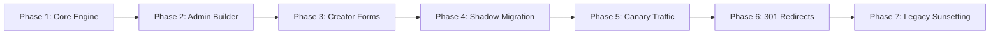

# Template & Render Engine — Production Release & Rollout Plan

This document outlines the phased production rollout sequence, gating criteria, and feature flag management for releasing the Generic Template & Render Engine into production.

---

## 1. Feature Flags Inventory

| Flag Name | Default | Scope | Description |
| :--- | :--- | :--- | :--- |
| `FEATURE_TEMPLATE_ENGINE` | `true` | Backend / Web | Enables the generic template and entry API endpoints and Admin UI. |
| `FEATURE_TEMPLATE_BUILDER` | `true` | Web Admin | Unlocks `/admin/templates/new` and drag-and-drop template designer. |
| `FEATURE_CREATOR_DYNAMIC_FORMS` | `true` | Web Creator | Directs creators to `/creator/entries/new` using dynamic form fields. |
| `FEATURE_DYNAMIC_PUBLIC_RENDERER`| `true` | Web Public | Renders `/content/:templateSlug/:entrySlug` using `DynamicEntryPage`. |
| `FEATURE_LEGACY_REDIRECTS` | `true` | Web Middleware | Enforces 301 redirects from `/places/:slug` and `/folklore/:slug`. |
| `FEATURE_LEGACY_FALLBACK` | `false` | Backend | Falls back to legacy tables if dynamic entry lookup fails. |
| `FEATURE_TEMPLATE_DRIFT_CRON` | `true` | Backend | Runs nightly cron auditing schema drift across published entries. |

---

## 2. Staged Rollout Phases

### Phase 1: Core Engine & DB Foundation (T - 7 Days)
- Deploy `@cg-tourism/template-engine` package to npm / monorepo internal registry.
- Apply PostgreSQL migrations for `ContentTemplate`, `TemplateField`, `TemplateVersion`, `ContentEntry`, `ContentAuditLog`, `ContentSearchIndex`.
- Verify PostGIS extensions and spatial indexes.
- **Gate**: All 79 backend test suites and 32 web test suites pass.

### Phase 2: Admin Template Builder Enablement (T - 5 Days)
- Set `FEATURE_TEMPLATE_BUILDER=true` for admin accounts.
- Seed canonical system templates: `destination`, `folklore`, `festival`, `cuisine`, `itinerary`.
- Perform administrative smoke test: Create test template, modify field validations, create new version.
- **Gate**: Zero unhandled exceptions in admin logs.

### Phase 3: Creator Dynamic Forms (T - 3 Days)
- Enable `FEATURE_CREATOR_DYNAMIC_FORMS=true` for internal tourism content creators.
- Creators author initial entries across `festival` and `cuisine` templates.
- Test review workflow: Creator submits $\rightarrow$ Moderator inspects diff $\rightarrow$ Moderator approves $\rightarrow$ Entry moves to `APPROVED`.
- **Gate**: Moderation lifecycle successfully verifies 10+ test entries.

### Phase 4: Shadow Migration of Legacy Content (T - 2 Days)
- Execute `migrate-legacy-content.ts` against staging and pre-production databases.
- Transform all existing `Place` records to `destination` entries.
- Transform all existing `Folklore` records to `folklore` entries.
- Verify 100% data parity between legacy records and dynamic entries.
- **Gate**: Spot audit confirms zero field truncations or coordinate errors.

### Phase 5: Canary Public Traffic (T - 1 Day)
- Enable `FEATURE_DYNAMIC_PUBLIC_RENDERER=true` at canary percentages:
  - 10% traffic for 2 hours (Monitor latency, Redis cache hit ratio, error rates).
  - 50% traffic for 4 hours.
  - 100% traffic across all public traffic.
- **Gate**: Public entry render response time $P_{95} \le 50\text{ms}$; 5xx error rate $< 0.01\%$.

### Phase 6: 301 Redirect Enforcement (Launch Day)
- Enable `FEATURE_LEGACY_REDIRECTS=true`.
- All legacy URLs (`/places/:slug`, `/folklore/:slug`) return HTTP 301 redirects to canonical `/content/:templateSlug/:slug`.
- Search engines update indexed URLs seamlessly.
- **Gate**: 100% of tested legacy URLs cleanly redirect with preserved query parameters.

### Phase 7: Legacy Model Sunsetting (T + 30 Days)
- Disable `FEATURE_LEGACY_FALLBACK`.
- Archive legacy tables `Place` and `Folklore` to cold storage dumps.
- Remove deprecated Prisma models and legacy controllers in follow-up cleanup branch.

---

## 3. Deployment Gating Checklist

- [ ] All automated tests pass:
  - `@cg-tourism/template-engine`: 28/28 tests passing.
  - Backend: 79 suites, 466+ tests passing.
  - Web: 32 suites, 142+ tests passing.
- [ ] Prisma schema validated with zero errors (`prisma validate`).
- [ ] Coordinate fields strictly normalized to `latitude` and `longitude`.
- [ ] Legacy redirects verified via automated integration tests.
- [ ] Database backup completed and verified restorable.
